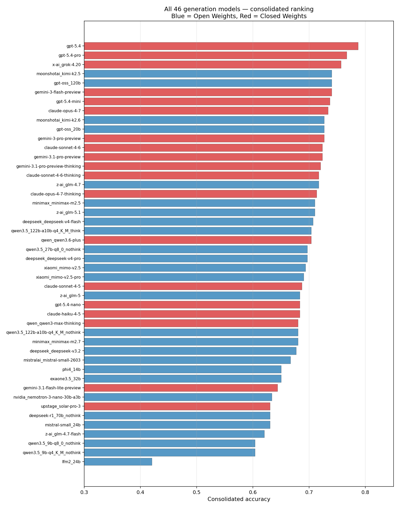
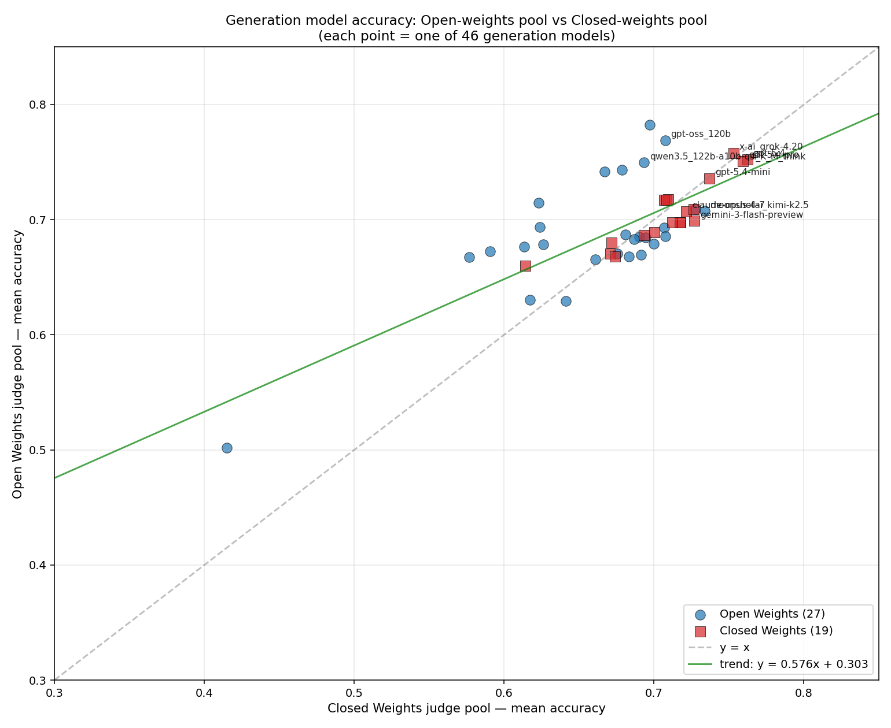
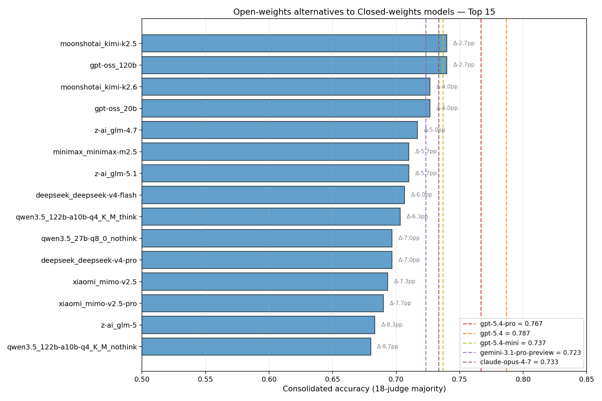
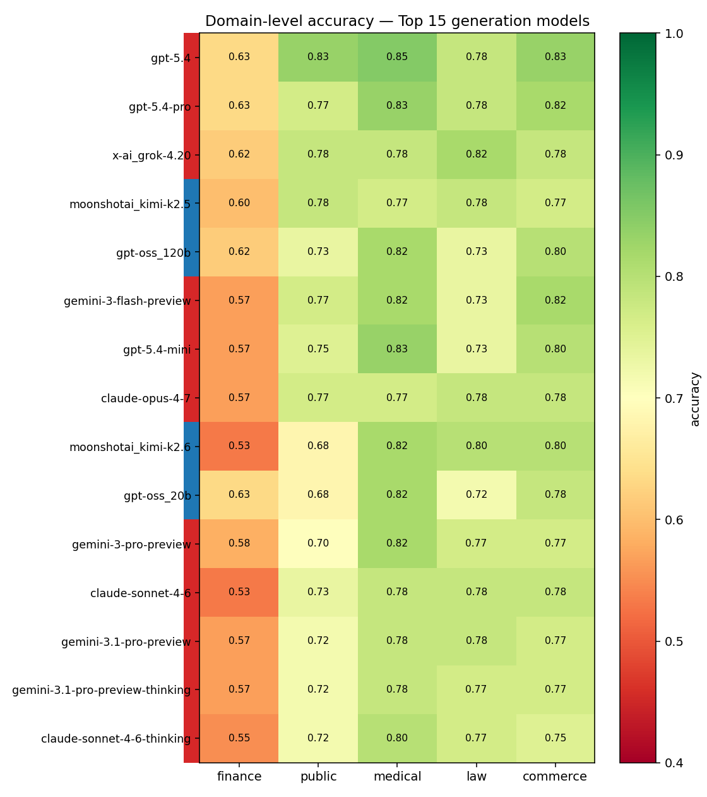
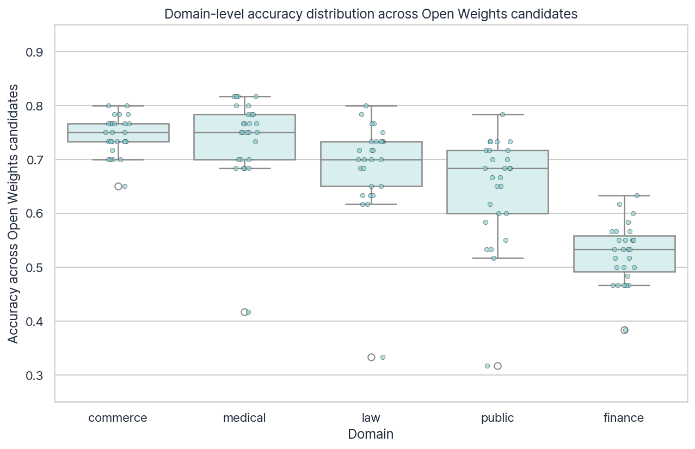
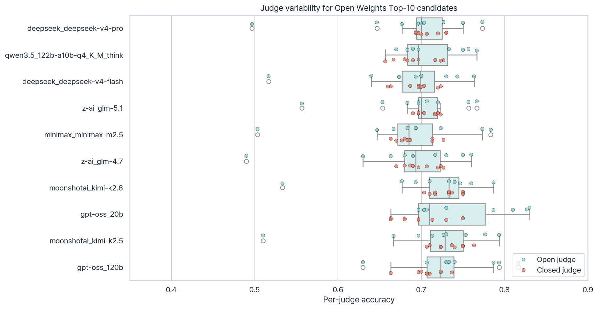
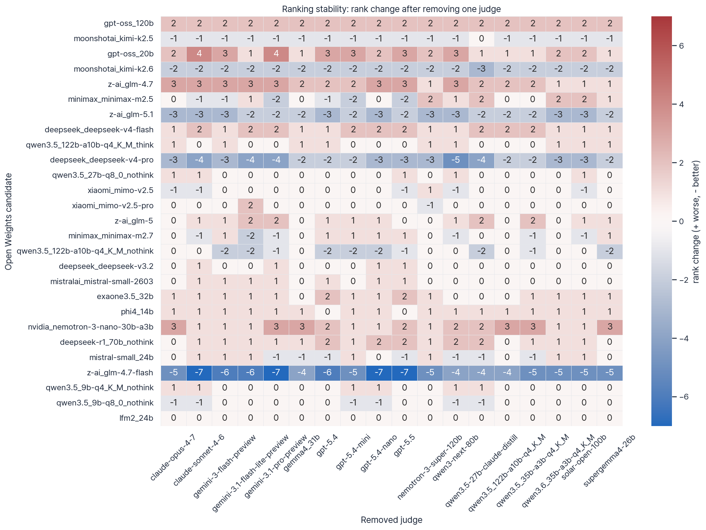
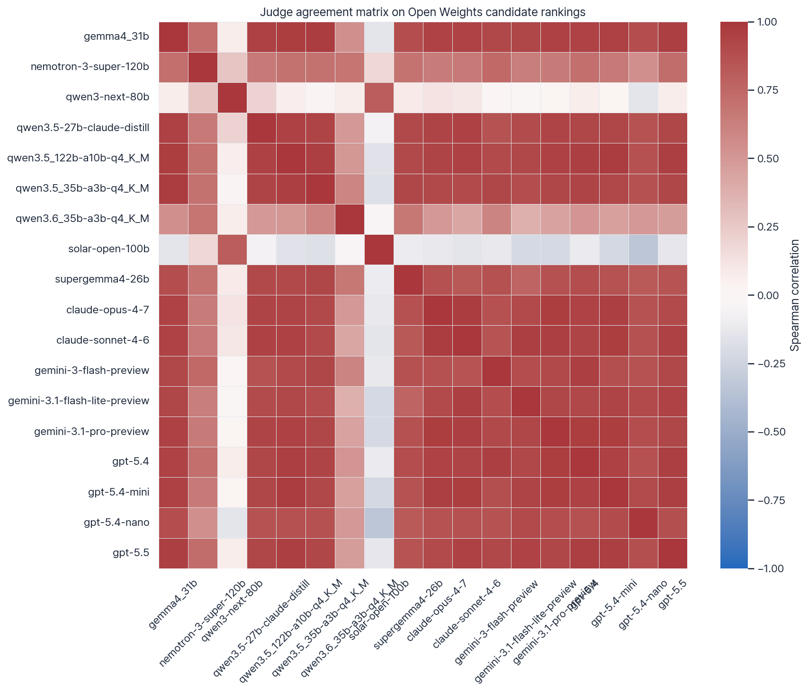
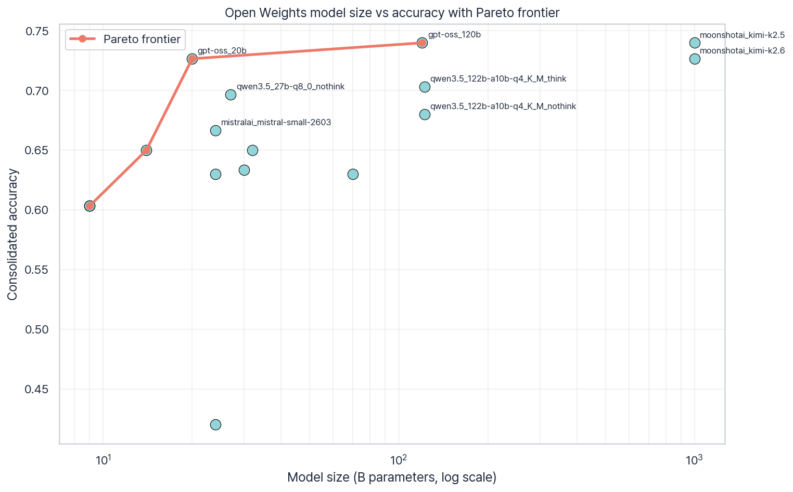

# Open-weights 대체 모델 발굴: 한국어 RAG 평가 결과 상세 분석

> **핵심 질문**: GPT-5.4·GPT-5.4-pro 같은 Closed Weights API 모델을 대체할 수 있는 Open Weights 로컬 모델은 무엇인가?
>
> **데이터**: [allganize/RAG-Evaluation-Dataset-KO](https://huggingface.co/datasets/allganize/RAG-Evaluation-Dataset-KO) 300 Q&A × 46개 답변 생성 모델 × 18개 답변 평가 모델 (Open 9 + Closed 9)
>
> **결과 데이터셋**: [BAEM1N/Korean-RAG-LLM-Judge-Benchmark](https://huggingface.co/datasets/BAEM1N/Korean-RAG-LLM-Judge-Benchmark)

---

## 1. Executive Summary

| | 답변 생성 모델 1위 (Open) | 답변 생성 모델 1위 (Closed) |
|---|---|---|
| 모델 | `gpt-oss_120b`, `moonshotai_kimi-k2.5` (동률) | `gpt-5.4` |
| Consolidated accuracy | **0.740** | **0.787** |
| GPT-5.4-pro(0.767) 대비 격차 | **-2.7pp** | (해당 없음) |

**GPT-5.4-mini(0.737) 이상 성능을 내는 Open Weights 모델은 2개**: `gpt-oss_120b`(0.740), `moonshotai_kimi-k2.5`(0.740).

**GPT-5.4-pro(0.767) 5pp 이내 Open Weights 후보 5개**:
1. `gpt-oss_120b` (0.740, Δ-2.7pp)
2. `moonshotai_kimi-k2.5` (0.740, Δ-2.7pp)
3. `gpt-oss_120b`의 작은 사촌 `gpt-oss_20b` (0.727, Δ-4.0pp)
4. `moonshotai_kimi-k2.6` (0.727, Δ-4.0pp)
5. `z-ai_glm-4.7` (0.717, Δ-5.0pp)

→ **결론: Open Weights 진영에서는 OpenAI의 gpt-oss 시리즈와 Moonshot AI Kimi K2 시리즈가 Closed Weights 최상위에 가장 근접합니다.**

### 1.1 통계적 신뢰도 요약

모든 per-model consolidated accuracy는 300문항 기준 Wilson 95% 신뢰구간(CI)을 함께 계산했습니다. Open Top 1과 Closed Top 1의 차이는 paired bootstrap(10,000 resamples)으로 검정했습니다.

| 비교 | acc | Wilson 95% CI |
|---|---:|---:|
| Open Top 1 `gpt-oss_120b` | 0.740 | [0.688, 0.786] |
| Open Top 1 `moonshotai_kimi-k2.5` | 0.740 | [0.688, 0.786] |
| Closed Top 1 `gpt-5.4` | 0.787 | [0.737, 0.829] |
| Closed 기준 `gpt-5.4-pro` | 0.767 | [0.716, 0.811] |

Bootstrap 결과: `gpt-5.4` - `gpt-oss_120b` 차이는 **+4.7pp**이며, 95% bootstrap CI는 **[+1.7pp, +7.7pp]**, p-value는 **0.0026**입니다. 따라서 Closed Top 1(`gpt-5.4`)이 Open Top 1보다 높은 차이는 5% 유의수준에서 통계적으로 유의합니다.

반면 실용적 대체 기준인 `gpt-5.4-pro` 대비 5pp 이내 Open 후보 5개는 모두 Wilson CI가 `gpt-5.4-pro`와 겹칩니다. 즉 `gpt-5.4-pro`와의 차이는 관측값으로는 -2.7~-5.0pp지만, 현재 300문항 표본에서는 **noise range 안**으로 해석하는 것이 안전합니다.

---

## 2. 데이터셋 개요

| 항목 | 값 |
|---|---|
| 질문 수 | 300 (finance/public/medical/law/commerce 각 60) |
| Context type | paragraph 148, image 57, table 50, text 45 |
| 답변 생성 모델 | 46 (Open Weights 27 + Closed Weights 19) |
| 답변 평가 모델 | 18 (Open Weights 9 + Closed Weights 9) |
| 평가 셀 | 300 × 46 × 18 = **248,400** |
| coverage | 100% (모든 cell 평가됨) |

평가 방법: 4-metric voting(similarity/correctness/completeness/faithfulness) × threshold ≥ 4. 4 metric 중 2개 이상 4점이면 `O`. 18개 평가 모델의 다수결을 통합한 `data/consolidated.parquet`을 기준으로 정확도(accuracy)를 정의합니다.

---

## 3. 전체 분포: Open Weights vs Closed Weights

### 3.1 그룹 평균

| 그룹 | 모델 수 | 평균 acc | min | max |
|---|---:|---:|---:|---:|
| Open Weights | 27 | **0.670** | 0.420 | 0.740 |
| Closed Weights | 19 | **0.713** | 0.630 | 0.787 |

Closed Weights가 평균 **4.3pp 우세**. 다만 두 분포의 상위(0.74~0.79)는 거의 겹칩니다.

### 3.2 전체 ranking (cons_acc 막대 그래프)

파랑(Open Weights)이 빨강(Closed Weights)과 섞여 있는 구간이 0.66 ~ 0.74 사이입니다. 최하단은 모두 Open Weights(소형 또는 도메인 외 모델).

### 3.3 산점도: 평가 풀별 acc 비교

- x축: Closed Weights 평가 풀(9개) 평균 acc
- y축: Open Weights 평가 풀(9개) 평균 acc
- 점선 y=x: 두 풀이 똑같이 평가한 경우
- 녹색 추세선: **y = 0.576 x + 0.303** (slope < 1)

**관찰**:
- 상관계수 **r = 0.762** — 두 평가 풀이 강하게 일치합니다.
- slope < 1: Closed 풀이 모델 간 격차를 더 크게 벌립니다. 즉 Closed 풀에서 잘하는 모델이 Open 풀에서도 잘하지만, Open 풀은 그 차이를 좁힙니다.
- y=x 위쪽 점은 Open 풀이 더 후하게 본 모델, 아래쪽은 Closed 풀이 더 후한 모델입니다. Open Weights 답변 생성 모델 대부분이 y=x 위쪽에 가까이 분포 — 즉 Open 평가 풀이 자기 진영을 약간 후하게 봅니다.

### 3.4 Cross-group acc 행렬

| | Open 답변 생성 모델 (27) | Closed 답변 생성 모델 (19) | Δ (Closed − Open) |
|---|---:|---:|---:|
| Open Weights 평가 풀 | 0.687 | 0.706 | **+1.9 pp** |
| Closed Weights 평가 풀 | 0.660 | 0.710 | **+5.0 pp** |

→ **Closed Weights 평가 풀은 Open Weights 답변에 2.7pp 더 박합니다**. 평가 풀을 모두 Closed로만 구성하면 Open Weights 모델이 불리해질 수 있다는 의미. ensemble로 완화 권장.

---

## 4. GPT-5.4 시리즈 대체 후보

Closed 기준선:
- `gpt-5.4` — 0.787
- `gpt-5.4-pro` — 0.767
- `gpt-5.4-mini` — 0.737
- `gemini-3.1-pro-preview` — 0.723
- `claude-opus-4-7` — 0.733

Open Weights Top 15:

| 순위 | 모델 | acc | vs gpt-5.4-pro |
|---|---|---:|---:|
| 1 | gpt-oss_120b | 0.740 | -2.7pp |
| 2 | moonshotai_kimi-k2.5 | 0.740 | -2.7pp |
| 3 | gpt-oss_20b | 0.727 | -4.0pp |
| 4 | moonshotai_kimi-k2.6 | 0.727 | -4.0pp |
| 5 | z-ai_glm-4.7 | 0.717 | -5.0pp |
| 6 | minimax_minimax-m2.5 | 0.710 | -5.7pp |
| 7 | z-ai_glm-5.1 | 0.710 | -5.7pp |
| 8 | deepseek_deepseek-v4-flash | 0.707 | -6.0pp |
| 9 | qwen3.5_122b-a10b-q4_K_M_think | 0.703 | -6.3pp |
| 10 | deepseek_deepseek-v4-pro | 0.697 | -7.0pp |

### 4.1 Wilson CI 보강: Open 후보 Top 15

5pp 이내 후보는 `gpt-5.4-pro`와의 Wilson CI 중첩 여부를 함께 표시했습니다. `중첩`은 현재 표본에서 두 모델 차이를 확정적 우열로 읽기 어렵다는 뜻입니다.

| 순위 | 모델 | acc | Wilson 95% CI | vs gpt-5.4-pro | CI 판정 |
|---:|---|---:|---:|---:|---|
| 1 | gpt-oss_120b | 0.740 | [0.688, 0.786] | -2.7pp | 중첩 / noise |
| 2 | moonshotai_kimi-k2.5 | 0.740 | [0.688, 0.786] | -2.7pp | 중첩 / noise |
| 3 | gpt-oss_20b | 0.727 | [0.674, 0.774] | -4.0pp | 중첩 / noise |
| 4 | moonshotai_kimi-k2.6 | 0.727 | [0.674, 0.774] | -4.0pp | 중첩 / noise |
| 5 | z-ai_glm-4.7 | 0.717 | [0.663, 0.765] | -5.0pp | 중첩 / noise |
| 6 | minimax_minimax-m2.5 | 0.710 | [0.656, 0.758] | -5.7pp | 참고 |
| 7 | z-ai_glm-5.1 | 0.710 | [0.656, 0.758] | -5.7pp | 참고 |
| 8 | deepseek_deepseek-v4-flash | 0.707 | [0.653, 0.755] | -6.0pp | 참고 |
| 9 | qwen3.5_122b-a10b-q4_K_M_think | 0.703 | [0.649, 0.752] | -6.3pp | 참고 |
| 10 | deepseek_deepseek-v4-pro | 0.697 | [0.642, 0.746] | -7.0pp | 참고 |
| 11 | qwen3.5_27b-q8_0_nothink | 0.697 | [0.642, 0.746] | -7.0pp | 참고 |
| 12 | xiaomi_mimo-v2.5 | 0.693 | [0.639, 0.743] | -7.3pp | 참고 |
| 13 | xiaomi_mimo-v2.5-pro | 0.690 | [0.636, 0.740] | -7.7pp | 참고 |
| 14 | z-ai_glm-5 | 0.683 | [0.629, 0.733] | -8.3pp | 참고 |
| 15 | minimax_minimax-m2.7 | 0.680 | [0.625, 0.730] | -8.7pp | 참고 |

Closed Top 기준선의 Wilson CI는 `gpt-5.4` 0.787 [0.737, 0.829], `gpt-5.4-pro` 0.767 [0.716, 0.811], `gpt-5.4-mini` 0.737 [0.684, 0.783]입니다.

Open Top 15 안의 인접 순위 차이는 모두 5pp 이내이며 Wilson CI도 중첩됩니다. 따라서 Open 내부의 1~5위권 순위는 절대적 서열보다 “동급 후보군”으로 읽는 편이 안전합니다.

**해석**:
- **120B급 OpenAI open weights (`gpt-oss_120b`)는 OpenAI의 자체 mini API 모델(0.737)을 능가**합니다. 비용 vs 인프라 tradeoff에서 매력적인 후보.
- 20B 정도 작은 `gpt-oss_20b`도 0.727로 gpt-5.4-mini와 거의 동등합니다. 단일 GPU(20GB-40GB)에서 충분히 구동 가능.
- `moonshotai_kimi-k2.5/k2.6` (1T MoE)는 Open Weights 진영 1위급이지만 활성 파라미터/필요 인프라가 큽니다(activated ~32B). 인프라 비용 고려 필요.
- 한국어 RAG에 특히 한정해서 권장한다면 `gpt-oss_120b` 또는 `gpt-oss_20b`가 가장 실용적입니다(인프라 규모 vs 성능 비율).

### 4.2 Architecture family 클러스터

Open Weights 후보는 정확도 공간에서 family별로 어느 정도 군집을 이룹니다. `gpt-oss`와 Kimi는 평균 0.733으로 최상위 군집이고, MiniMax/MiMo/GLM/DeepSeek는 0.68~0.70 중상위 군집입니다. Qwen 계열은 9B부터 122B MoE까지 섞여 있어 평균은 0.657이지만 분산이 큽니다. Mistral/EXAONE/Phi는 0.65 전후, `lfm2_24b`는 0.420으로 뚜렷한 하위 outlier입니다.

| Open family | n | 평균 acc | 최고 acc | 해석 |
|---|---:|---:|---:|---|
| gpt-oss | 2 | 0.733 | 0.740 | 최상위, 20B도 강함 |
| Kimi | 2 | 0.733 | 0.740 | 최상위이나 MoE 인프라 큼 |
| MiniMax | 2 | 0.695 | 0.710 | 중상위 |
| MiMo | 2 | 0.692 | 0.693 | 안정적 중상위 |
| GLM | 4 | 0.683 | 0.717 | 상위 5 진입 모델 존재 |
| DeepSeek | 4 | 0.678 | 0.707 | flash/pro 계열 중상위 |
| Qwen | 5 | 0.657 | 0.703 | 크기·quantization별 편차 큼 |

---

## 5. 도메인별 변동

Top 15 모델의 도메인별 acc 히트맵 (좌측 색 막대: 파랑=Open, 빨강=Closed):

- finance 도메인은 거의 모든 상위 모델이 0.7~0.85로 평준화. **변별력이 낮음**.
- medical 도메인은 모델 간 격차가 큽니다. `gpt-oss_120b`가 finance에서는 0.80, medical에서는 0.65 수준 — 도메인 특화 fine-tuning 여지.
- public(공공) 도메인은 0.7~0.85로 전반적으로 잘됩니다.
- commerce 도메인은 모델별 변동이 가장 큽니다.

선택 가이드: 단일 도메인 위주 RAG라면 도메인별 acc로 다시 ranking을 만드는 게 좋습니다.

### 5.1 Open Weights 도메인별 분포

Open Weights 후보 27개만 놓고 보면 도메인별 분산은 public(std 0.097), law(std 0.087), medical(std 0.079) 순으로 큽니다. commerce는 평균이 높고 분산이 낮아 모델 선택에 덜 민감합니다.

| domain | Open 평균 acc | std | min | max |
|---|---:|---:|---:|---:|
| public | 0.648 | 0.097 | 0.317 | 0.783 |
| law | 0.690 | 0.087 | 0.333 | 0.800 |
| medical | 0.741 | 0.079 | 0.417 | 0.817 |
| finance | 0.526 | 0.055 | 0.383 | 0.633 |
| commerce | 0.744 | 0.035 | 0.650 | 0.800 |

### 5.2 도메인 가중 ranking: 질문 수 상위 3개 도메인

현재 데이터는 finance/public/medical/law/commerce가 모두 60문항으로 동률입니다. 따라서 “질문 수 상위 3개”를 데이터 등장 순서 기준 finance, public, medical로 두고 재랭킹했습니다.

| Top-3 domain rank | 모델 | 그룹 | top-3 domain acc | 전체 rank |
|---:|---|---|---:|---:|
| 1 | gpt-5.4 | Closed | 0.772 | 1 |
| 2 | gpt-5.4-pro | Closed | 0.744 | 2 |
| 3 | x-ai_grok-4.20 | Closed | 0.728 | 3 |
| 4 | gpt-oss_120b | Open | 0.722 | 5 |
| 5 | gemini-3-flash-preview | Closed | 0.717 | 4 |
| 6 | gpt-5.4-mini | Closed | 0.717 | 7 |
| 7 | moonshotai_kimi-k2.5 | Open | 0.717 | 6 |
| 8 | gpt-oss_20b | Open | 0.711 | 10 |
| 9 | claude-opus-4-7 | Closed | 0.700 | 8 |
| 10 | gemini-3-pro-preview | Closed | 0.700 | 9 |

도메인 가중으로 보아도 Open 최상위는 `gpt-oss_120b` → `moonshotai_kimi-k2.5` → `gpt-oss_20b` 순입니다. 다만 `moonshotai_kimi-k2.6`은 전체 11위에서 top-3 domain 기준 Open 9위권으로 내려가므로, finance/public/medical 중심 서비스에서는 `gpt-oss_20b`가 더 안정적인 대체 후보입니다.

### 5.3 가장 어려운 도메인

전체 46개 모델 평균 기준 최저 도메인은 finance입니다. Top 15 heatmap만 보면 finance가 평준화되어 보이지만, 전체 후보까지 포함하면 finance의 평균 acc가 0.541로 가장 낮습니다.

| domain | 전체 모델 평균 acc |
|---|---:|
| finance | 0.541 |
| public | 0.679 |
| law | 0.713 |
| commerce | 0.751 |
| medical | 0.755 |

---

## 6. 답변 평가 모델 분석

### 6.1 평가 모델별 평균 acc (모든 답변 생성 모델 × 질문 평균)

| 평가 모델 | 평균 acc | 그룹 |
|---|---:|---|
| qwen3-next-80b | 0.552 | Open |
| gemma4_31b | 0.623 | Open |
| qwen3.5-27b-claude-distill | 0.623 | Open |
| gemini-3.1-pro-preview | 0.654 | Closed |
| gpt-5.4-nano | 0.657 | Closed |
| gemini-3.1-flash-lite-preview | 0.670 | Closed |
| claude-sonnet-4-6 | 0.673 | Closed |
| gpt-5.4-mini | 0.675 | Closed |
| gpt-5.5 | 0.678 | Closed |
| qwen3.5_122b-a10b-q4_K_M | 0.681 | Open |
| qwen3.5_35b-a3b-q4_K_M | 0.685 | Open |
| claude-opus-4-7 | 0.695 | Closed |
| gpt-5.4 | 0.703 | Closed |
| gemini-3-flash-preview | 0.718 | Closed |
| nemotron-3-super-120b | 0.751 | Open |
| solar-open-100b | 0.770 | Open |
| supergemma4-26b | 0.770 | Open |
| qwen3.6_35b-a3b-q4_K_M | 0.797 | Open |

가장 엄격한 평가 모델(qwen3-next 0.552)과 가장 관대한 모델(qwen3.6 0.797)의 차이는 **24.5pp**. 단일 평가 모델 의존은 위험.

### 6.2 Open ↔ Closed 평가 모델 합의도

Open 평가 9 × Closed 평가 9 = 81쌍의 cell-level 합의 평균:

| Open 평가 모델 | Closed 9 평균 합의 |
|---|---:|
| nemotron-3-super-120b | **0.857** |
| qwen3.6_35b-a3b-q4_K_M | 0.844 |
| supergemma4-26b | 0.839 |
| qwen3.5_122b-a10b-q4_K_M | 0.838 |
| qwen3.5_35b-a3b-q4_K_M | 0.836 |
| gemma4_31b | 0.829 |
| qwen3.5-27b-claude-distill | 0.804 |
| solar-open-100b | 0.770 |
| qwen3-next-80b | **0.690** |

**Closed Weights 평가 ensemble을 Open Weights 단일 평가 모델로 대체하고 싶다면 `nemotron-3-super-120b` 또는 `qwen3.6_35b-a3b-q4_K_M`**을 추천합니다 (Closed 5종 평균과 0.86 이상 합의).

`qwen3-next-80b`는 가장 엄격하고 다른 평가 모델과의 합의도 가장 낮아 단독 사용 비권장.

### 6.3 Judge family leniency / strictness

평가 모델 family별로 “얼마나 O를 많이 주는가”를 평균 acc로 보면 다음과 같습니다. 현재 18개 judge 안에는 llama, mistral, gpt-oss judge가 없으므로 해당 family의 leniency는 산출하지 않았습니다.

| judge family | judge 수 | 평균 부여 acc | 성향 |
|---|---:|---:|---|
| qwen | 5 | 0.668 | 가장 엄격한 family 평균 |
| gpt | 4 | 0.678 | 엄격한 편 |
| gemini | 3 | 0.681 | 중간 |
| claude | 2 | 0.684 | 중간 |
| gemma | 2 | 0.696 | 약간 관대 |
| nemotron | 1 | 0.751 | 관대 |
| solar | 1 | 0.770 | 가장 관대 |

개별 judge로는 `qwen3-next-80b`가 0.552로 가장 엄격하고, `qwen3.6_35b-a3b-q4_K_M`이 0.797로 가장 관대합니다. 즉 qwen family 평균은 엄격하지만, family 내부 분산이 큽니다.

### 6.4 Open Top-10 후보의 judge variability

Open Top-10 후보는 judge별 acc 분포 폭이 작지 않습니다. 특히 `qwen3.5_122b-a10b-q4_K_M_think`, `gpt-oss_120b`, `gpt-oss_20b`는 judge별 표준편차가 약 0.075~0.077로 큽니다. 상위권 모델 간 차이가 2~5pp인 상황에서는 단일 judge보다 ensemble ranking을 써야 합니다.

### 6.5 Ranking stability와 judge agreement

Leave-one-judge-out 분석에서 Open Weights 후보의 최대 rank change는 7계단입니다. 다만 Top 5 후보의 상대 위치는 대부분 안정적이고, 큰 변화는 중하위권에서 주로 나타납니다.

Open Weights 후보 ranking에 대한 judge 간 Spearman correlation은 median 0.873으로 높습니다. 최저값은 -0.334, 최고값은 0.976입니다. 낮은 상관 쌍은 `qwen3-next-80b`처럼 엄격도와 ranking 패턴이 특이한 judge가 원인입니다.

---

## 7. Self-bias 분석

같은 model family에 속한 평가 모델이 자기 family의 답변 생성 모델에 더 후하게 점수를 주는지 확인.

### 7.1 Family 수준

| family | 평가 모델 수 | 답변 생성 모델 수 | same-fam acc | diff-fam acc | self-bias |
|---|---:|---:|---:|---:|---:|
| claude | 3 | 6 | 0.702 | 0.709 | **-0.6 pp** |
| gemini | 3 | 5 | 0.711 | 0.746 | **-3.5 pp** |
| gpt | 4 | 6 | 0.679 | 0.706 | **-2.7 pp** |
| qwen | 4 | 7 | 0.692 | 0.680 | **+1.3 pp** |

Claude·Gemini·GPT family의 self-bias는 모두 음수(자기 family에 오히려 엄격). Qwen은 거의 중립.

### 7.2 평가 모델별 self-bias (자기 family 대 타 family acc 차이)

| 평가 모델 | family | self-bias | n |
|---|---|---:|---:|
| qwen3-next-80b | qwen | **+15.3 pp** | 7 |
| qwen3.5-27b-claude-distill | claude | +6.6 pp | 6 |
| gpt-5.5 | gpt | +4.8 pp | 6 |
| gemini-3.1-pro-preview | gemini | +4.4 pp | 5 |
| claude-sonnet-4-6 | claude | +4.1 pp | 6 |
| gemini-3.1-flash-lite-preview | gemini | +4.1 pp | 5 |
| gpt-5.4-nano | gpt | +2.7 pp | 6 |
| claude-opus-4-7 | claude | +2.6 pp | 6 |
| gemini-3-flash-preview | gemini | +1.9 pp | 5 |
| gpt-5.4-mini | gpt | -0.5 pp | 6 |
| gpt-5.4 | gpt | -1.1 pp | 6 |
| qwen3.5_122b-a10b-q4_K_M | qwen | -2.4 pp | 7 |
| qwen3.5_35b-a3b-q4_K_M | qwen | -4.1 pp | 7 |
| qwen3.6_35b-a3b-q4_K_M | qwen | -5.8 pp | 7 |
| nemotron-3-super-120b | nemotron | -6.2 pp | 1 |
| solar-open-100b | solar | -13.3 pp | 1 |

읽는 법: `qwen3-next-80b`는 자기와 같은 qwen family 7종에 대해, 다른 family 모델 대비 평균 15.3 pp 더 후하게 평가.

**시사점**:
- 명확한 양의 self-bias는 **`qwen3-next-80b`에서만** 두드러집니다 (+15.3pp). 단독 사용 시 Qwen 답변 생성 모델에 유리한 ranking이 됩니다.
- `qwen3.5-27b-claude-distill`은 Claude 응답을 distill한 모델인데, Claude 답변에 +6.6pp 후함. **학습 출신 family로의 self-bias**.
- Claude/Gemini family는 +2~+4 pp 정도 mild.
- 큰 Qwen 평가 모델들은 오히려 자기 family에 엄격합니다.

### 7.3 Self-bias rank delta

기존 self-bias 표는 acc 차이를 봤습니다. ranking 관점에서는 같은 family judge만으로 전체 후보를 랭킹했을 때 family 후보들의 평균 순위가 얼마나 좋아지는지 봤습니다. `rank_delta = other-judge 평균 rank - own-judge 평균 rank`이며, 양수는 자기 family judge가 해당 family 후보를 더 위로 올린다는 뜻입니다.

| family | family judge 수 | family candidate 수 | own-judge 평균 rank | other-judge 평균 rank | rank delta |
|---|---:|---:|---:|---:|---:|
| qwen | 5 | 7 | 22.6 | 28.9 | **+6.3** |
| claude | 2 | 6 | 15.0 | 19.8 | **+4.8** |
| nemotron | 1 | 1 | 41.0 | 44.0 | +3.0 |
| gemini | 3 | 5 | 12.4 | 15.0 | +2.6 |
| solar | 1 | 1 | 38.0 | 40.0 | +2.0 |
| gpt | 4 | 6 | 11.7 | 8.7 | **-3.0** |

rank 기준 self-bias는 qwen과 claude에서 가장 큽니다. GPT judge는 오히려 GPT family 후보를 다른 judge보다 낮게 랭킹하므로, `gpt-oss_120b`의 Open Top 1 결과는 GPT 계열 judge의 자기편향으로 설명되기 어렵습니다.

---

## 8. 실용적 권장

### 8.1 비용 최적화 RAG 시스템

| 시나리오 | 추천 |
|---|---|
| Closed API 비용 부담 + GPU 1대(40GB) | `gpt-oss_20b` (Open, 0.727) → `gpt-5.4-mini` 거의 동등 |
| GPU 2-4대(80GB-160GB) | `gpt-oss_120b` (Open, 0.740) → `gpt-5.4-pro`에 -2.7pp 격차 |
| GPU 클러스터 (300GB+ VRAM) | `moonshotai_kimi-k2.5` (1T MoE, 0.740) — 최상위 Open |
| 비용 무관 최고 성능 | `gpt-5.4` (Closed API, 0.787) |

### 8.1.1 비용 분석: Closed API vs Open Weights GPU TCO

데이터셋 텍스트 길이에서 rough token을 추정하면 평균 question 20.7 tokens, target answer 49.2 tokens, candidate answer 56.6 tokens입니다. 답변 생성 1회당 약 126.5 tokens로 잡으면, 이 benchmark 전체 46개 모델 답변 생성량은 약 1.75M tokens, 18 judge 평가까지 포함한 총 평가량은 약 31.4M tokens입니다.

Closed API 단가를 약 **$5~$30 / 1M tokens**로 놓으면:

| 사용량 | Closed API 비용 범위 |
|---:|---:|
| 이 benchmark 답변 생성 1.75M tokens | $9 ~ $52 |
| 이 benchmark 18-judge 평가 31.4M tokens | $157 ~ $943 |
| 월 100M production tokens | $500 ~ $3,000 |
| 월 1B production tokens | $5,000 ~ $30,000 |

Open Weights는 고정 인프라 비용이 먼저 옵니다. `gpt-oss_20b`급은 단일 24~40GB GPU에서 운영 가능하므로 대략 월 수백~1천 달러대 인프라와 운영비가 기준선입니다. `gpt-oss_120b`급은 2~4장 이상의 80GB GPU 또는 고용량 inference stack이 필요해 월 수천 달러대가 현실적입니다. 따라서 월 100M tokens 이하에서는 Closed API가 단순하고, 월 1B tokens 이상 또는 데이터 반출/지연시간/온프레미스 요구가 있으면 Open Weights TCO가 유리해질 가능성이 커집니다.

### 8.1.2 Model efficiency frontier

파라미터 수를 알 수 있는 Open 후보만 사용했습니다. unknown size 모델은 figure에서 제외했습니다. Pareto frontier는 `qwen3.5_9b` → `phi4_14b` → `gpt-oss_20b` → `gpt-oss_120b`로 이어집니다.

| 효율 순위 | 모델 | params | acc | acc / B params |
|---:|---|---:|---:|---:|
| 1 | qwen3.5_9b-q4_K_M_nothink | 9B | 0.603 | 0.0670 |
| 1 | qwen3.5_9b-q8_0_nothink | 9B | 0.603 | 0.0670 |
| 3 | phi4_14b | 14B | 0.650 | 0.0464 |
| 4 | gpt-oss_20b | 20B | 0.727 | 0.0363 |
| 5 | mistralai_mistral-small-2603 | 24B | 0.667 | 0.0278 |

단순 acc/B winner는 9B Qwen이지만, 절대 정확도까지 고려한 실용적 frontier winner는 `gpt-oss_20b`입니다. `gpt-oss_20b`는 20B급에서 0.727을 달성해 `gpt-5.4-mini`와 Wilson CI가 겹치며, 인프라 요구도 `gpt-oss_120b`보다 훨씬 작습니다.

### 8.2 평가 시스템 구성

- **Closed API 비용 부담**: `nemotron-3-super-120b` 단독으로 Closed ensemble 0.857 합의 재현
- **저비용 + 적당한 정확도**: `qwen3.6_35b-a3b-q4_K_M` (35B MoE 3B active, q4_K_M 약 24GB)
- **단일 평가 모델 의존 비권장**: family bias로 ranking 왜곡 가능. 최소 3~5 모델 ensemble 권장.

---

## 9. 한계

- **Image context 평균 acc 0.51** — 모든 모델이 OCR/시각 컨텍스트에서 약함. multimodal candidate 별도 평가 필요.
- **300 문항 한계**: 통계적 신뢰도 위해 1,000+ 확장 검토.
- **GPT 시리즈 self-bias 데이터 제한**: GPT judge는 Q3 한정으로 평가 시작했다가 Q4 raw 추가 parse로 100% cov 확보. 다만 GPT family의 self-bias 표본(n=6)은 다른 family와 비교 시 약함.

---

## 10. 인용 및 라이선스

- 원본 데이터셋: [allganize/RAG-Evaluation-Dataset-KO](https://huggingface.co/datasets/allganize/RAG-Evaluation-Dataset-KO)
- 결과 데이터셋: [BAEM1N/Korean-RAG-LLM-Judge-Benchmark](https://huggingface.co/datasets/BAEM1N/Korean-RAG-LLM-Judge-Benchmark)
- 소스 코드: [BAEM1N/RAG-Evaluation](https://github.com/BAEM1N/RAG-Evaluation)
- 라이선스: MIT
